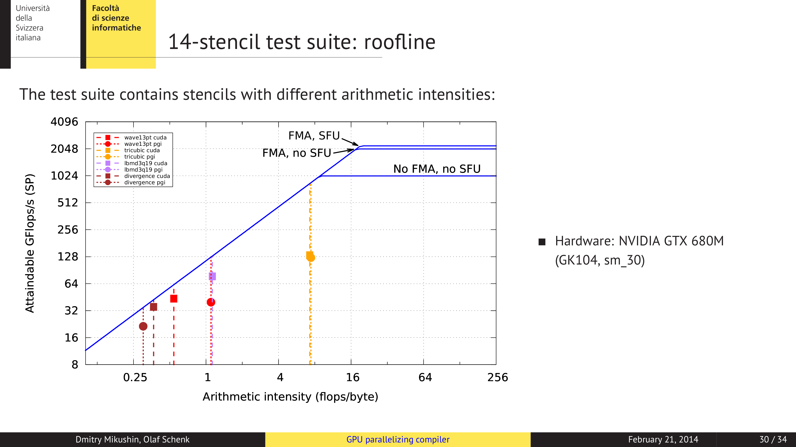

# GPU manual and compiler-driven parallelization of stencil micro-applications

This is a supporting material for the talk given at SIAM Parallel Processing Conference in Portland, 21st Feb 2014.

[Presentation slides](siam_pp14.pdf)

The rest of this this README contains the original notes for the slides.

## 1

Hi, my name is Dmitry. Together with Prof. Olaf Schenk we came here from the University of Lugano, Switzerland to share with you some noteworthy results we've made during both manual and compiler-driven optimization of stencil codes for NVIDIA GPUs.

## 3

One of the most cited papers on the stencil optmizations on GPUs is Paulius Micikevicius' study by example of wave equation stencil. Released in 2009, it presented performance results and techniques specific to the GT200 family of GPUs. In a nutshell, the optimization techniques there were based on optimizing the data reuse factor by tiling grid points slices in shared memory in 2D plane, and caching vertical columns in registers for the remaining 3rd dimension. Although this paper continues to be frequently cited, the GPU architecture has evolved signigicantly since that.

## 4

Given that tiling nowdays appears to be like a universal silver bullet, we decided to check if that very well known approach also gives a speedup on modern GPUs. Could there also be something else unexpectedly beneficial for stencil applications? And what of those optimizations we can bring to compilers.

## 5

The following wave equation stencil has been extracted from the seismic application we work with. It has 3 arrays for 1 current and 2 past time levels and the dependency on 13 neighbor grid points.

## 6

By reproducing Paulis method on this stencil using the same old hardware he used 5 years ago, we can get a speedup factor of three against the naive CUDA version - let's remember this result!

## 7

In naive CUDA version we use nearly optimal block size and process a single point in each thread. Now moving from the legacy hardware to the modern GPUs, we will compare different optimization techniques on Kepler SM30 mobile GPU.

## 8

Considering other possible optimizations, Kepler has a shuffle instruction, that allows the values of registers to be exchanged between threads of the same warp. So, by using shuffling we can get a kind of virtual shared memory. However, in this case we only exchange data, which is not very efficient. I'd expect shuffle to show some benefit on stencils where not only data, but also parts of computations could be shared between the neighboring threads.

## 9

Next, we tried to organize 1D tiles in X dimension, which gave some minor improvement.

## 10

Caching of vertical column values in registers makes the kernel slower.

## 11

It gets faster, if we add vectorized data load/stores

## 12

And gets much faster, if we only do 1D tiling together with vectorized load/stores

## 13

Tiling in 2 dimensions makes the performance much worse.

## 14, 15, 16

We tried to add caching in registers and vectorization on top of it, but the performance is still worse than the naive CUDA version.

## 17

If we do only vectorization, the improvement is almost the same as for vectorization together with 1 dimensional tiling.

## 18

And adding of shuffle does not give anything

## 19

Overall the combination of 1d tiling and vectorization gives the best performance improvement on Kepler SM30 GPU. We also tested Kepler K20, where the variant with vectorization appears to be the fastest. So, as you see, surprisingly, tiling does not give almost any improvement, compared to the speedup factor of 3 we've seen on old GPUs.

## 20

Now analysing the naive and vectorized versions, we've found that naive version of memory-bound stencil is apparently compute-bound in terms of the generated GPU code, while we would expect it to be memory-bound as in theory, right? And what the vectorization does - it simply turns the code to be memory-bound, as expected.

## 21

In terms of dataflow, vectorization allows more efficient use of global memory. Vectrorized kernel utilizes almost the same global memory throughput, as the device-device memory copy.

## 22

We've found a number of other effects, but the main improvement seems to be the better global memory efficiency. And the most important drawback of vectorization is up to two times larger register footprint.

## 23

Among stencil codes of our benchmark we have one that has to use more than 50 registers per thread. On Kepler SM30 this means that vectorized version will need more than 100 registers, and results into excessive spilling and no improvement. However, on K20 the register file is larger, and as result the vectorized version is faster by the same 15% we've seen for wave equation stencil.

## 24

For the minor optimizations that do not need a lot of code change we found that by doing the following transformation in loop bounds, we can get another 13% improvement. In original version first thread handled the first inner grid point. It turns to be better, if we give first two threads no job by omitting the offset of 2 here, and placing the early exit here instead.

And the second point - unfortunaltely, we've found no improvement from use of automatic texture cache on K20, which remains an open question.

## 25

OK, so we can do some optimizations by hand, but obviously it's better to have compilers doing them. Omitting the domain-specific languages, I'd subdivie GPU-enabled compilers into OpenACC and polyhedral tools. The long-standing limitations of OpenACC some time ago prompted us to start our own compiler called KernelGen, which belongs to class of polyhedral tools. Polyhedral compiler by definition searches for parallel layout of the given loop iteration space. Another example of such tool is PPCG, introduced last year.

## 26

We very able to assemble KernelGen, our polyhedral compiler, mostly from the open-source components, with exception of NVIDIA parts that remain closed-source.

## 27

The compilation approach we deploy is somewhat different from other compilers. We don't try to make up the final version of every GPU kernel upon the compilation step. Instead, we save partially processed code with the binary and perform the rest of the work in runtime, which is the analysis for parallelism, optimization and code generation.

## 28

In runtime we have additional information available, such as runtime constants and pointers values. This values are substituted right into the code and help to resolve unknown aliases during pointer analysis.

## 29

We've verified KernelGen works well on Fermi and Kepler GPUs, for instance this chart is for Kepler GTX 680. Here, the values above 1 mean that KernelGen generates faster kernel than PGI or CAPS, for instance, for divergence test it's 2 and 2.5 times faster.

## 30

We believe this benchmark should be representative, because in our test suite we have included stencils with different compute profiles. For instance wave equation stencil here is memory-bound and tricubic stencil -- the one with large register footprint -- mentioned earlier, is more compute-bound.

## 31 

For the conclusions of this study we'd like to outline that tiling is not beneficial on modern GPUs, at least for those stencils that we considered. The most interesting optimization we have discovered is vectorization on GPUs, it appears to be almost unknown, with exception of one very recent blog post. Or results showed that polyhedral compilers are able to beat commercial OpenACC compilers on many test stencils, and we possibly can make these comilerz even better by teaching them to do new optimizations we've discovered. The most hard case is when the stencil is coded in non-coalescing way - is there an automatic approach for their transformation -- it's sill an open question.

## 32

And finally: our main reason to give this presentation is to offer you and your colleagues a collaboration in polyhedral GPU compiler development and joint work on stencil test suite for OpenACC/CUDA and other targets like Xeon Phi. If you're interested - you can easily find us in Google by typing KernelGen :)

